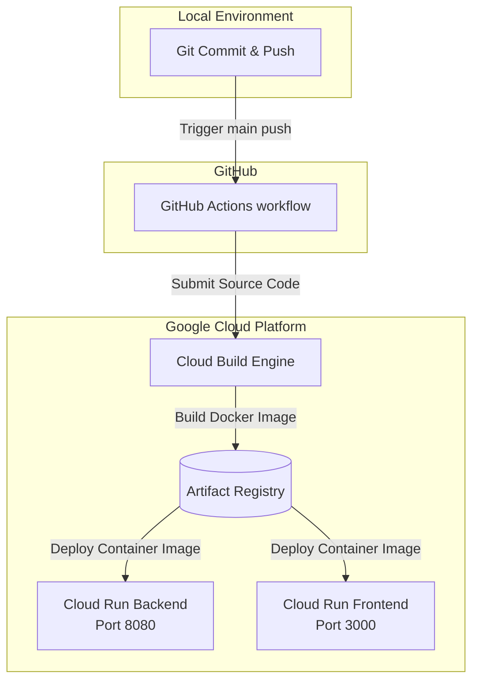

# TONES 서비스 GCP 통합 배포 및 CI/CD 가이드북

이 문서는 **TONES** 서비스의 백엔드(`TONES_Server`, FastAPI)와 프론트엔드(`TONES_Client`, Next.js)를 **Google Cloud Platform (GCP)**에 배포하고, **GitHub Actions**를 통해 실시간 자동 무중단 배포(CI/CD) 파이프라인을 구축하는 통합 가이드라인입니다.

GCP에서 컨테이너 기반 애플리케이션을 배포하기에 가장 효율적인 서버리스 서비스인 **Google Cloud Run**을 기준으로 작성되었습니다.

---

## 🏗️ 전체 서비스 배포 아키텍처



---

## 🛠️ 공통 사전 준비 작업

GCP 배포 및 CLI 실행을 위해 로컬 환경에 아래와 같은 사전 세팅이 되어 있어야 합니다.

1. **GCP 프로젝트 준비**: [GCP Console](https://console.cloud.google.com/)에서 프로젝트 생성 및 **결제 계정(Billing) 연동 필수**
2. **GCP CLI 설치**: 로컬 PC에 [gcloud CLI](https://cloud.google.com/sdk/docs/install)가 완벽히 구성되어 있어야 함
3. **IAM 권한**: 배포 계정에 `소유자(Owner)` 혹은 `Cloud Run 관리자`, `Storage 관리자`, `Cloud Build 편집자` 권한 부여 필수
4. **로컬 CLI 로그인 및 타겟팅**:
   ```bash
   gcloud auth login
   gcloud config set project [YOUR_PROJECT_ID]
   ```

---

## 💻 PART 1. 백엔드 (FastAPI) 실전 배포

백엔드는 수동 빌드 후 배포하는 **표준 2단계 방식**으로 안전하게 배포를 수행합니다.

### 1. 인프라 설정 파일 검증
백엔드 폴더(`TONES_Server`) 내부에 아래 파일들이 정상적으로 존재하는지 체크합니다.

* **[Dockerfile](file:///d:/대외%20활동%20자료/Contest/Google%20AI%20Agent%20Challenge/Project/TONES_Server/Dockerfile)**: 가상환경(`/opt/venv`) 분리 복사 및 바이너리 다이렉트 실행형(`CMD ["uvicorn", ...]`)으로 구성되어 윈도우 개행(CRLF) 및 권한 오류를 원천 차단함
* **[.dockerignore](file:///d:/대외%20활동%20자료/Contest/Google%20AI%20Agent%20Challenge/Project/TONES_Server/.dockerignore)**: 로컬 `.venv`, 캐시 등이 빌드 서버로 올라가지 않도록 격리함

### 2. 환경 변수 파일 (`.env.yaml`) 기입
프로젝트 보안을 위해 민감 키를 주입하기 위해 `TONES_Server/.env.yaml` 파일을 만들고 아래 설정 정보를 저장합니다:
```yaml
PROJECT_NAME: "WooYeonChoiYeonWoo Server"
API_V1_STR: "/api/v1"
SECRET_KEY: "your-super-secret-key-change-this-in-production"
ACCESS_TOKEN_EXPIRE_MINUTES: "60"
SUPABASE_URL: "https://grkqqgleqegesqzjwkrt.supabase.co"
SUPABASE_KEY: "sb_publishable_..."
SUPABASE_SERVICE_ROLE_KEY: "sb_secret_..."
PINECONE_API_KEY: "pcsk_..."
PINECONE_ENVIRONMENT: "us-east-1"
PINECONE_INDEX_NAME: "https://..."
GEMINI_API_KEY: "AIzaSy..."
```

### 3. 실전 배포 명령어 (2단계)
터미널에서 `TONES_Server` 경로로 이동한 뒤 순서대로 찔러줍니다.

```bash
# [1단계] Cloud Build 이미지 원격 빌드 및 저장
gcloud builds submit --tag asia-northeast3-docker.pkg.dev/[PROJECT_ID]/cloud-run-source-deploy/tones-backend:latest

# [2단계] 생성된 이미지를 바탕으로 Cloud Run 서비스 가동
gcloud run deploy tones-backend \
    --image asia-northeast3-docker.pkg.dev/[PROJECT_ID]/cloud-run-source-deploy/tones-backend:latest \
    --port 8080 \
    --region asia-northeast3 \
    --allow-unauthenticated \
    --env-vars-file .env.yaml
```

---

## 🎨 PART 2. 프론트엔드 (Next.js) 실전 배포

프론트엔드는 Node.js 런타임을 기반으로 하며 백엔드 서버의 API 실서버 주소와 정밀하게 맵핑해 주어야 합니다.

### 1. 인프라 설정 파일 검증
프론트엔드 폴더(`TONES_Client`) 내부에 아래 파일들이 완벽하게 대기 중인지 확인합니다.

* **[Dockerfile](file:///d:/대외%20활동%20자료/Contest/Google%20AI%20Agent%20Challenge/Project/TONES_Client/Dockerfile)**: 멀티 스테이지 빌드 방식의 프로덕션 `node:20-alpine` Next.js 구동형 Dockerfile
* **[.dockerignore](file:///d:/대외%20활동%20자료/Contest/Google%20AI%20Agent%20Challenge/Project/TONES_Client/.dockerignore)**: 로컬 `node_modules` 및 빌드 결과 폴더(`.next`) 업로드 차단함

### 2. 환경 변수 파일 (`.env.yaml`) 기입
프론트엔드 빌드 및 API Fetch를 위해 `TONES_Client/.env.yaml` 파일을 신규 생성한 뒤 저장합니다. (※ `NEXT_PUBLIC_FASTAPI_URL` 값은 방금 배포 완료된 백엔드 서비스의 GCP HTTPS URL을 정확히 매핑해야 합니다.)
```yaml
NEXT_PUBLIC_FASTAPI_URL: "https://tones-backend-xxxxx-an.a.run.app"
NEXT_PUBLIC_SUPABASE_URL: "https://your-project.supabase.co"
NEXT_PUBLIC_SUPABASE_ANON_KEY: "your-supabase-anon-key"
GEMINI_API_KEY: "your-gemini-api-key"
```

### 3. 실전 배포 명령어 (2단계)
터미널에서 `TONES_Client` 경로로 이동한 뒤 순서대로 실행합니다:

```bash
# [1단계] Next.js 프로덕션 원격 빌드 실행 및 저장
gcloud builds submit --tag asia-northeast3-docker.pkg.dev/[PROJECT_ID]/cloud-run-source-deploy/tones-frontend:latest

# [2단계] Next.js 포트 3000번 매핑하여 Cloud Run 서비스 가동
gcloud run deploy tones-frontend \
    --image asia-northeast3-docker.pkg.dev/[PROJECT_ID]/cloud-run-source-deploy/tones-frontend:latest \
    --port 3000 \
    --region asia-northeast3 \
    --allow-unauthenticated \
    --env-vars-file .env.yaml
```

---

## 🤖 PART 3. GitHub Actions를 통한 CI/CD 실시간 자동 배포

코드를 리포지토리에 push하면 자동으로 빌드와 배포까지 완료해 주는 완벽한 CI/CD 환경 구축 방법입니다.

### 1단계: 배포 전용 서비스 계정(`github-deployer`) 생성
GCP 콘솔 [IAM 및 관리자 ➡️ 서비스 계정] 메뉴에서 생성하며, 생성 시 아래 **4가지 필수 역할(Role)**을 반드시 추가해 줍니다:
* `Cloud Run 관리자` (`roles/run.admin`) — Cloud Run 배포 관리
* `Artifact Registry 작성자` (`roles/artifactregistry.writer`) — 이미지 푸시 권한
* `Storage 관리자` (`roles/storage.admin`) — 빌드 소스 아카이브 임시 저장
* `서비스 계정 사용자` (`roles/iam.serviceAccountUser`) — Cloud Run 기동 권한 매핑용

### 2단계: 서비스 계정의 IAM 권한 보강 명령어 실행 (중요)
서비스 에이전트 간 권한 충돌 및 `ContainerImageImportFailed` 에러를 사전에 완벽히 소거하기 위해 로컬 터미널에서 다음 IAM 바인딩 명령을 확실히 실행합니다:

```bash
# Compute Engine 기본 계정에 아티팩트 리더 권한 추가
gcloud projects add-iam-policy-binding [YOUR_PROJECT_ID] \
    --member="serviceAccount:[PROJECT_NUMBER]-compute@developer.gserviceaccount.com" \
    --role="roles/artifactregistry.reader"

# Cloud Run 서비스 에이전트 로봇 계정에 아티팩트 리더 권한 추가
gcloud projects add-iam-policy-binding [YOUR_PROJECT_ID] \
    --member="serviceAccount:service-[PROJECT_NUMBER]@serverless-robot-prod.iam.gserviceaccount.com" \
    --role="roles/artifactregistry.reader"
```

### 3단계: 다운로드한 JSON 보안 키를 GitHub Secrets에 등록
1. 서비스 계정 페이지에서 **[키(Keys)] ➡️ [새 키 만들기] ➡️ JSON** 타입으로 키를 다운로드합니다.
2. 내 GitHub 백엔드/프론트엔드 저장소 페이지 ➡️ **[Settings] ➡️ [Secrets and variables] ➡️ [Actions]** 로 진입합니다.
3. New repository secret을 생성하여 값들을 매핑합니다:
   * **Name**: `GCP_SA_KEY`
   * **Value**: 다운로드받은 JSON 파일 안의 텍스트 전체 붙여넣기

### 4단계: 워크플로우 YAML 파일 생성
프로젝트 루트 디렉토리 `.github/workflows/deploy.yml` 에 설정 내용이 들어가 있는지 확인한 뒤 GitHub main 브랜치로 `git push`를 진행해 줍니다. 

이제 main 브랜치에 코드가 push되거나 병합되는 즉시 GCP Cloud Run으로 무중단 실시간 배포가 진행됩니다!
